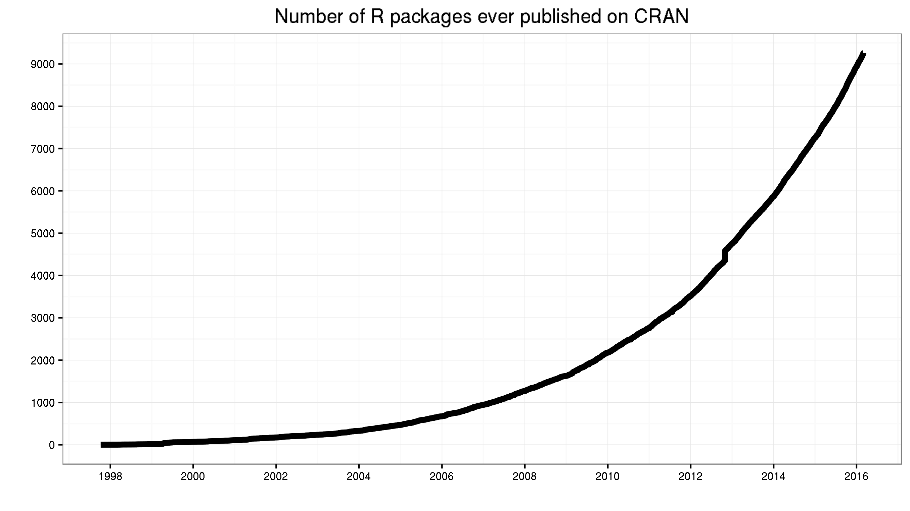
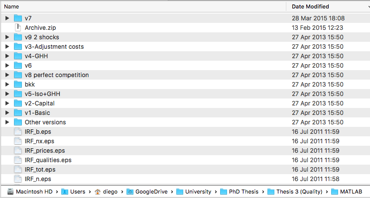

```{r setup, include=FALSE}
library(knitr)
library(data.table)
library(ggplot2)
library(magrittr)
library(tidyr)
opts_chunk$set(echo = FALSE, fig.align = 'center')
```

## Objectives

This **is not** intended as a course on statistical methods or econometric techniques! 

Instead, you will learn how to 

- Explore, groom, visualize, and analyze data 
- Make your code reproducible, reusable, and shareable 
- Improve the efficiency and enjoyability of your workflow

## Outline

1. An overview of the R ecosystem
2. Data visualization
3. Data wrangling
4. Data Analysis

The R Ecosystem
===============

## R

- A programming language and software environment
- Created by Ross Ihaka and Robert Gentleman
    - 1993: Research project in Auckland, NZ  
    - 1995: R Released as **open-source software**
    - 1997: R core group formed...
    - 2000: R 1.0.0 released
- Designed for statistical analysis and graphics
    - As opposed to general purpose language, such as Python
- Published under GNU license -> **Open source!**
 
## R - Extensibility

- Capabilities of R are extended through **user-created packages**
- Packages are mainly hosted on **[CRAN](https://cran.r-project.org)**
    - quality and licensing requirements
    - core group volunteers and automated testing
- Other popular repositories:
    - Bioconductor (for bioinformatics)
    - Github (mostly for development)
    
## R - Extensibility

<div style="text-align:center">
 <br>
<a href = "http://blog.revolutionanalytics.com/2016/03/16-years-of-r-history.html"> Find out more </a>
</div>
    
## R - Popularity

<div style="text-align:center">
 <br>
<a href = "http://blog.revolutionanalytics.com/popularity/"> Find out more </a>
</div>

## RStudio

- Free and open source [IDE for R](www.rstudio.com)
- Desktop and Server
- **Panes** 
    - Code Editor, Console, Debugger, Plots, Viewer, Packages...
- **Cheatsheets!**
- **Options**
    - Tip: turn off automatic save / load of your last session.
- **Projects**
    - Great way to organize your work
- **Packages**
    - Become an R developer

## RMarkdown

- **Markdown** is a text-to-HTML conversion tool developed by John Gruber (no relation!)
- It allows you to write using an easy-to-read, easy-to-write plain text format, then convert to HTML
- Quick reference in RStudio
- [RMarkdown](http://rmarkdown.rstudio.com) allows you to intersperse Markdown with *R-chunks*
- Also supported: **LaTeX!**
- Other output formats: PDF, Word, Github, RTF, ODT, custom formats
- **Reproducible Research:** full computational environment required to reproduce the results in a research paper (data, code, etc.)

## Version Control



## Version Control

- **Keep track of changes** in your project
- **Backup** your files and restore previous versions
- Maintain **multiple versions**, eventually merge them
- **Collaborate** with people
- **Share** your work with the world

## Git

- Git is a decentralized version control system
- Created by Linus Torvalds
- Current standard in software development
- Command line or GUI
    - RStudio
    - Sourcetree
- Remote repository services
    - Github
    - Bitbucket
  
## Git Repository Structure


## Basic Git commands

For this class...

- status
- add
- commit
- push
- pull

Learn more at [Codecademy](https://www.codecademy.com/learn/learn-git)


Data Visualization
=====================

## Why visualize

- Things we typically look for in data:
    - Trends
    - Gaps
    - Outliers
- We're well equipped for visual analysis
    - High bandwith input device: our eyes
    - Powerful CPU with sophisticated image-recognition algorithms: our brains.
- Information => Interpretation => Action

## Anscombe's Quartett

Four sets of `(x,y)` pairs, quick inspection hardly reveals any differences...

```{r, results='asis'}
anscombe_tidy <- anscombe %>%
  data.table %>% .[, obs := 1:.N] %>% 
  gather(key, value, -obs) %>%
  separate(key, c("variable", "set"), 1, convert = TRUE) %>% 
  data.table %>% .[, set := LETTERS[set]] %>%
  spread(variable, value)

anscombe_tidy %>% 
  dcast.data.table(obs~set, value.var = c("x", "y")) %>% 
  tail(5) %>% 
  kable(align = "c")
```

## Anscombe's Quartett

Comparing some basic statistics, differences appear to be minimal...

```{r, results='asis', size="small"}
anscombe_tidy[, .(
  mean = mean(y),
  var = var(y),
  corr = cor(x, y),
  reg_coef_a = lm(y ~ x)$coefficients[1],
  reg_coef_b = lm(y ~ x)$coefficients[2]
), by = set] %>% kable(digits = 2, align = "c")
```

## Anscombe's Quartett

Yet visual inspection quickly reveals the differences!

```{r, fig.width=10, fig.height=5}
anscombe_tidy %>% ggplot(aes(x, y)) + 
  facet_wrap(~set) + 
  geom_point() + 
  geom_smooth(method = lm, se = F) +
  theme_bw()
```

## Visualization in a data analysis workflow

- Explore
- Iterate
- Communicate

## Outline

- A grammar of graphics
- ggplot2
- Best practices

## Grammar of graphics

> **Grammar:** The basic elements of an area of knowledge or skill (Oxford Online)

- A grammar will let us answers questions such as:
    - What is a graphic?
    - How do you describe a graphic?
    - How do you create a graphic?
- References:
    - Wilkinson, Anand, and Grossman (2005), *The Grammar of Graphics*
    - Wickham (2010), *A Layered Grammar of Graphics*

## Elements

- A graphic is made out of one or more **layers**
- Each layer consists of a series of **elements**:
    - Data
    - A **geometry** and related **positioning** of its components
    - A **mapping** between the data and the aesthetic components of the selected geometry
    - A **facetting** scheme
    - A **scale** and a **coordinate system**
    - A **statistical transformation**
    - Annotations
- We will now explore each in detail

## Data

We need to generate some simple data for our example...

```{r results='asis'}
mydata <- data.table(
  A = c(2,1,4,9),
  B = c(3,2,5,10),
  C = c(4,1,15,80),
  D = c("a", "a", "b", "b")
)
kable(mydata, align = "c")
```

## Geometry

- A *geom* refers to the basic shapes of our graphic (points, lines, bars, etc.)
- Each geom has a set of aesthetic elements
- Some geoms can have different ways of positioning these elements (e.g. stacked bars vs. contiguous bars)
- Let's draw a *scatter plot*. We need to define the following properties:
    - **Horizontal position**
    - **Vertical position**
    - Shape
    - Size
    - Color
    - ...
  
## Mapping data to aesthetics

Let's connect our data to the aesthetics of the selected geom:

- Variable `A` to the horizontal position
- Variable `C` to the vertical position
- Variable `D` to point shape

```{r}
mydata[ , `:=`(x = A, y = C, Shape = D), by = .()]
kable(mydata[, .(x, y, Shape)], align = "c")
```

## Faceting

- Separate panels representing subsets of data
- No faceting for this simple example, will come back to it later

## Scales

- Transform variable values to units that can be represented on the screen or paper
- Each aesthetic property requires a scale (e.g. an axis or a legend).
- Example: transform `x` with a linear scale:
$$\text{floor}\left(\frac{x - \min(x)}{\text{range}(x)}\times\text{Screen width}\right)$$
- Shape mapping:
    - Group "a": circle
    - Group "b": square

## Scales 

Suppose we wished to map values of `x` to the range [0,200] and values of `y` to the range [0,300]. Our data take the following values:
```{r}
myscale <- function(var, space) {
  floor((var - min(var))/diff(range(var))*diff(range(space))) + min(space)
}
mydata[ , `:=`(
  x = myscale(x, c(0, 200)), 
  y = myscale(y, c(0, 300)), 
  Shape = ifelse(Shape == "a", "circle", "square")
), by = .()]
kable(mydata[, .(` ` = D, x, y, Shape)], align = "c")
```

## Statistical Transformation

- Rescaled data can be transformed by a statistic function:
    - Mean
    - Median
    - Regression
    - Density
    - Etc.
- Transformation must be scale invariant:
$$f(x + a) = f(x) + a \qquad \text{y} \qquad f(b \cdot x) = b \cdot f(x)$$
- For this example the most basic transformation: Identity

## Coordinate System

- Coordinate systems change the appearance of a grahpic 
- We only consider cartesian plane
- Other systems:
  - Geodesic projections are important when working with cartographic data
  - Polar coordinates
  - Mosaics
  - Etc.

## Annotations 

- Elements that hep us with the interpretation of a graphic:
    - Titles
    - Grids
    - Etc.

## Basic example: Result

```{r}
basic_plot <- mydata %>% ggplot(aes(x = A, y = C)) + 
  layer(
    mapping = aes(shape = D), 
    geom = "point", 
    stat = "identity",
    position = "identity",
    params = list(size = 8, na.rm = TRUE)) + 
  scale_shape_manual(values = c(16, 15)) + 
  scale_x_continuous(labels = NULL) +
  scale_y_continuous(labels = NULL) +
  ggtitle("Title") + 
  theme_classic() + theme(legend.position = "none")
basic_plot
```

## Faceting

Add some complecity partitioning by variable D:

```{r fig.width=7}
basic_plot + facet_grid(~D)
```

## Multiple Layers

- Graphics can have multiple layers
- In general, the elements described so far can be described on a per-layer basis, except:
    - Faceting
    - Coordinate system
- Often, layers share several common elements.
- Add a layer of lines to our plot... 

## Multiple Layers

```{r}
basic_plot + layer(
  geom = "smooth", 
  stat = "smooth", 
  position = "identity",
  params = list(method = lm, se = F, color = "blue", na.rm = TRUE)
  )
```

Statistical transformation: linear regression


